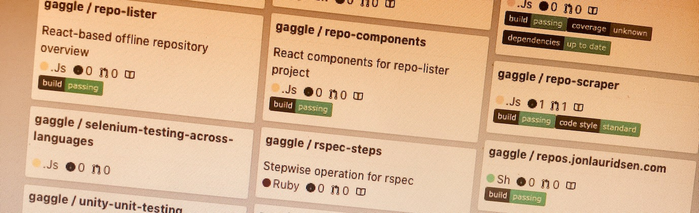

# repo-lister [](https://travis-ci.org/gaggle/repo-lister) [](https://standardjs.com)

Generate a static site showing an overview of your repositories. Well, actually [repo-scraper][repo-scraper] generates the data of your repositories, but repo-lister generates the site that **shows** that data.



Relies on [repo-components][components] ([Styleguide][styleguide]), and is consumed by [repos.jonlauridsen.com][repos.jonlauridsen.com].

Introduced and described on this blog: **[dev.to: repo-lister, a simple way to get an overview of repositories][dev.to]**


## Development
* `npm run dev` to run a local server

It is also possible to edit components and see changes reflected live in this repository. Ideally it wouldn't be necessary because of [repo-components][components] isolated nature, but in practice I've not managed to nail that workflow because e.g. only this repository has the necessary styling to fully render a component.

To enable live-editing of components edit `package.json` dependency to point to your local `repo-components` folder, e.g.:
```json
    "repo-components": "file:../repo-components"
```
(remember to re-run `npm i`)

Now you can run `npm run dev` in both folders and changes in `repo-components` gets reflected live.


## Cutting a new release
Run this command to automatically increment version and push a new release:
```bash
npm run clean && npm test && npm version patch && (export VERSION=`node -p "require('./package.json').version"`; git push && git push origin v$VERSION)
```


[components]: https://github.com/gaggle/repo-components
[dev.to]: https://dev.to/jonlauridsen/repo-lister-a-simple-way-to-get-an-overview-of-repositories-90l
[repo-scraper]: https://github.com/gaggle/repo-scraper
[repos.jonlauridsen.com]: https://github.com/gaggle/repos.jonlauridsen.com
[styleguide]: https://gaggle.github.io/repo-components/
